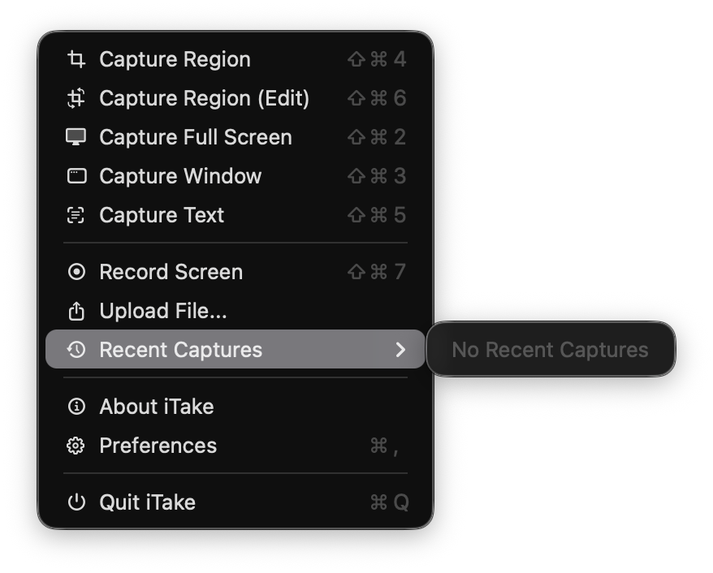
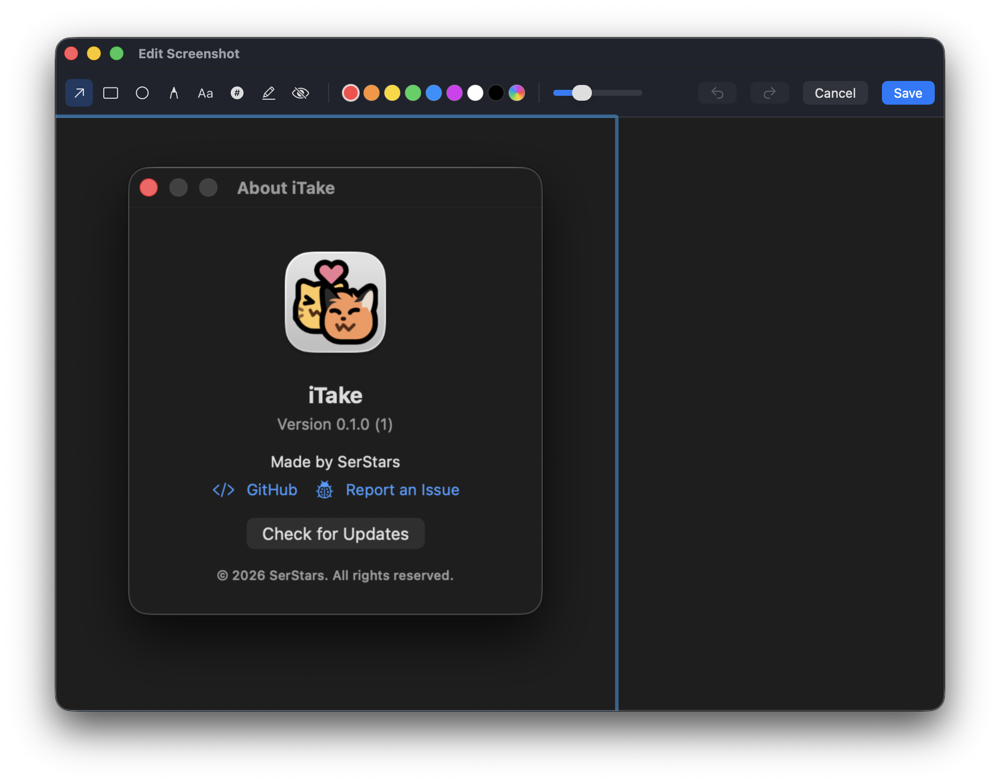
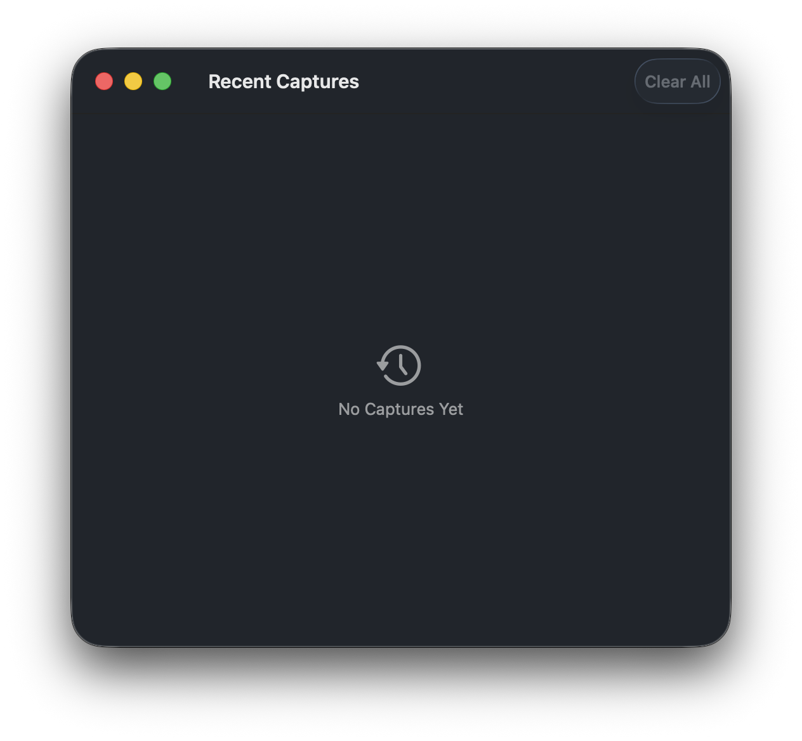
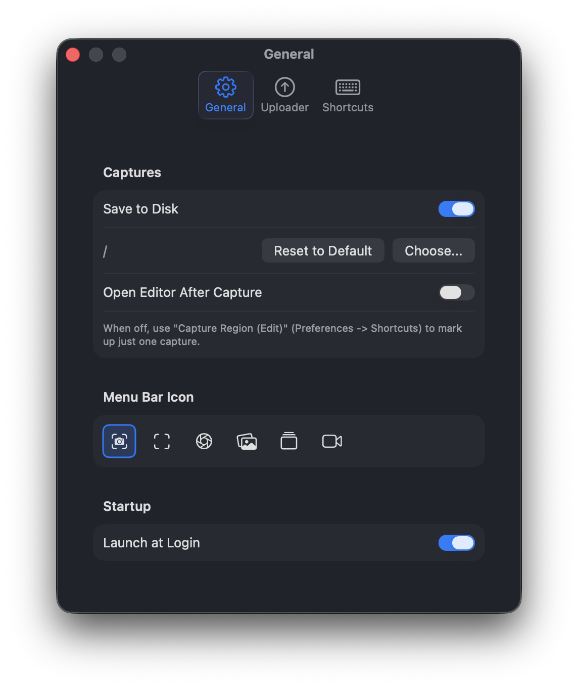
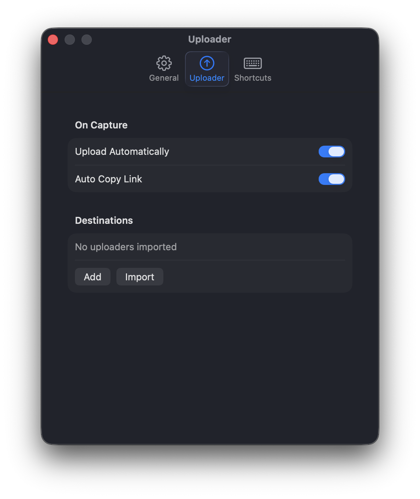
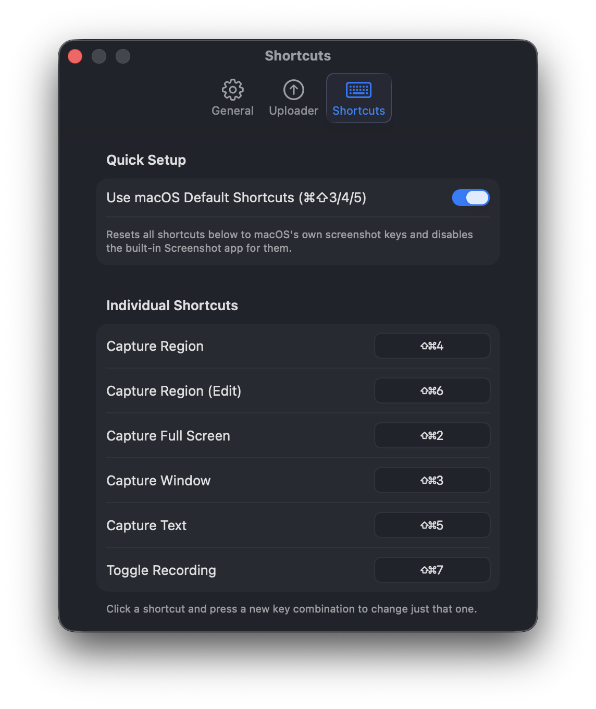

# iTake

A native macOS menu bar app for screenshots, screen recording, OCR, annotation and uploads.

- Capture a region, window or the full screen
- Mark up with arrows, shapes, text and blur
- Record your screen with system audio
- Pull text off anything on-screen using OCR
- Pin captures to your screen
- Save, copy or upload text and media to a HTTP endpoint, with no Dock icon or third-party frameworks, using `AppKit`/`SwiftUI`, `ScreenCaptureKit`, `AVFoundation`, `Vision`, and `CoreImage`.

## Showcase

| Menu Bar | Annotation Editor | Recent Captures |
| --- | --- | --- |
|  |  |  |

<details>
<summary>Settings</summary>

| General | Uploader | Shortcuts |
| --- | --- | --- |
|  |  |  |

</details>

## Features

- **Screenshots**: Screenshot a region, window, or full screen. Uses the native `screencapture` picker
- **Annotation editor**: Arrows, lines, rectangles, ellipses, triangles, stars, rounded rectangles, speech bubbles, freehand pens, eraser, text, numbered step badges, highlighter and blur. Highlighter, erasers and blur are brush tools you paint on freely. Every placed item is selectable, draggable and deletable, with undo/redo, custom colours and zoom for precise editing
   - Optionally opens after capture
- **Screen recording**: Record a region, window or full display with pause, resume and optional system audio
- **OCR ("Capture Text")**: Select a region to capture its text and copy it to your clipboard or use "Capture Text (Translate)" to see the recognized text and its translation side by side
- **Pin to Screen**: Pin a region so it floats on top of everything. Pinned regions are draggable, stackable and switchable to click-through, with a fade so you can tell it's there, when it's in your way
- **Recent Captures**: Thumbnail history with copy, upload, reveal, delete and a full browsable window
- **Configurable uploader**: Upload to one or more HTTP destinations, built and edited right in Preferences or via your own `.itup` config file
  - Upload progress and confirmations show as small floating overlays. Failed upload offers to save the capture to disk instead of discarding it
- **Customizable global hotkeys**: With an option to take over macOS's own `⌘⇧3`/`⌘⇧4`/`⌘⇧5` screenshot shortcuts
- **Menu bar only**: No Dock icon or main window, with a choice of menu bar icons

## Requirements

- MacOS 15 (Sequoia) or later
- To build: Xcode Command Line Tools (`swiftc`, `codesign`). A full Xcode install isn't required as this is a plain Swift Package

## Installing

Download the latest [Release](https://github.com/SerStars/iTake/releases). The app is not signed with a Developers Certificate so you may receive "Apple could not verify iTake is free of malware", to fix it:

1. Drag `iTake.app` into `/Applications`
2. Follow one of the solutions:
   - Right-click it in Finder > **Open** > confirm **Open** (double clicking won't work) 
   - Go to **System Settings** > **Privacy & Security** > **Scroll to the Bottom** > **Click on "Open Anyway"**
   - From Terminal: `xattr -cr /Applications/iTake.app`
3. On first capture or recording, grant **Screen Recording** access when MacOS asks (System Settings > Privacy & Security). You may need to relaunch iTake for it to take effect
4. On first file upload to your uploader, grant Keychain access by entering your password for Keychain and click on "Always Allow"

## Building & Running

`swift run` isn't enough. Menu bar behaviour and TCC permissions need a real signed `.app`. Use the following scripts instead:

```sh
# build + package + launch
scripts/run.sh

# just build + package
scripts/build_app.sh

# package into a distributable .dmg
scripts/build_dmg.sh
```

## Default Keyboard Shortcuts

Customizable in **Preferences > Shortcuts**:

| Action                 | Default |
| ----------------------- | ------- |
| Capture Region          | `⌃⌘⇧2`  |
| Capture Region (Edit)   | `⌃⌘⇧1`  |
| Capture Full Screen     | `⌃⌘⇧3`  |
| Capture Window          | `⌃⌘⇧4`  |
| Capture Text (OCR)      | `⌃⌘⇧5`  |
| Capture Text (Translate)| `⌃⌘⇧6`  |
| Pin Region              | `⌃⌘⇧7`  |
| Toggle Recording        | `⌃⌘⇧R`  |

"Capture Region (Edit)" always opens the annotation editor regardless of the "Open Editor After Capture" setting.
The "Use macOS Default Shortcuts" toggle switches to `⌘⇧3`/`⌘⇧4`/`⌘⇧5` and disables the built-in Screenshot app' response to those keys.

## The Uploader & `.itup` Files

Build a destination directly in **Preferences > Uploader**, or hand-write a `.itup` file (plain
JSON, double-click to import):

```json
{
  "name": "My Uploader",
  "request": {
    "url": "https://example.com/api/upload",
    "method": "POST",
    "headers": { "Authorization": "Bearer YOUR_API_KEY" }
  },
  "body": { "type": "multipart", "fileField": "file", "fields": {} },
  "response": { "linkPath": "url" }
}
```

`body.type` is `"multipart"` or `"raw"` 
`response.linkPath` is a dot-path into the JSON response pointing at the resulting URL (e.g. `"files.0.url"`)
Header/secret values live in the Keychain, never in the file itself, safe to export and share. Examples are in [`examples/`](examples/)

## Where Things Are Saved

| What                                  | Where                                                                 |
| -------------------------------------- | ---------------------------------------------------------------------- |
| Screenshots & recordings               | Matches macOS's own screenshot location, or `~/Desktop`. Changeable in **Preferences > General** |
| Recent Captures history + thumbnails   | `~/Library/Application Support/iTake/`                                 |
| Preferences, hotkey bindings & Uploader configs          | `UserDefaults`, domain `com.SerStars.iTake`                            |
| Uploader secrets                       | macOS Keychain                          |

## Credits
- Neocat & Neofox snuggle emote by [Volpeon](https://volpeon.ink/) used as the app icon

## License
[GPL-3.0](/LICENSE)
